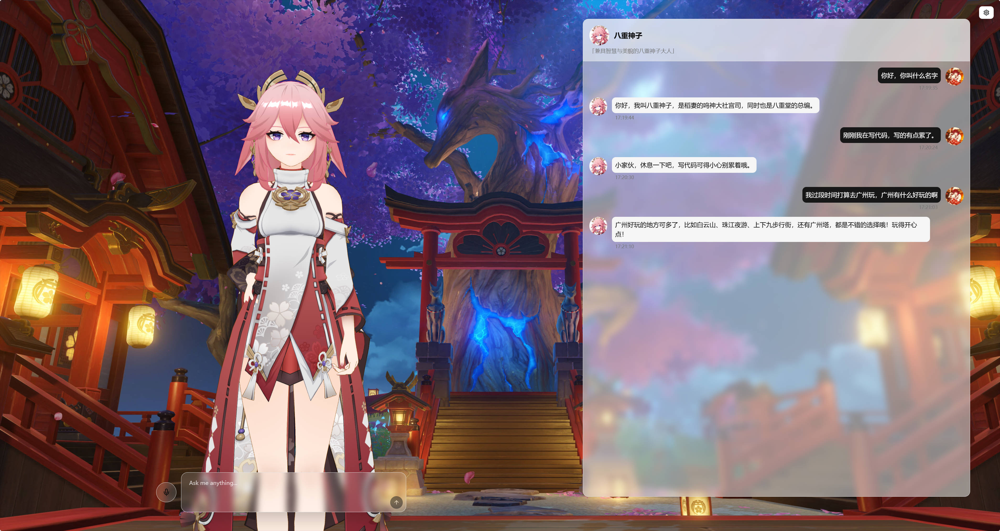

<div align="center">

# ${\color{#F77FBE}K}\color{#E87AB8}o\color{#D975B2}k\color{#CA70AC}o\color{#BB6BA6}r\color{#AC66A0}o\color{#9D619A}M\color{#8E5C94}a\color{#7F578E}t\color{#705288}e\color{#614D82}\color{#52487C}\color{#434376}\color{#343E70}\color{#25396A}\color{#163464}\color{#072F5E}\color{#4B61D1}$

</div>

> [!NOTE]
>
> With the emergence of **Grok Ani**, I realized that I was working on something similar💡. To bring the concept of virtual companions for anime characters to life, I have decided to open-source my current project🔓. However, due to time constraints⌛, the current version is not fully developed in various aspects😅. Additionally, due to a lack of experience in front-end development👨‍💻, many front-end features were implemented using a vibe coding approach🎨. Therefore, the current version may have several issues⚠️, which is why I have named it *v0.1.0*. Many of my ideas have yet to be implemented🛠️, and I will continue to improve this project in the future. Stay tuned👀.
> 
> **Please share a $\color{orange} STAR$ ⭐ if this project does help**




## 📢 Latest Updates
* **July-19-2025:** 🎉 ${\color{red} First\ KokoroMate \ update!}$


## ✨ Usage

```bash
git clone https://github.com/LongHZ140516/KokoroMate.git
cd KokoroMate
```

### Prepraration

#### Backend(Python)

```shell
conda create -n kokoromate python=3.12
conda activate kokoromate
pip install torch==2.5.1 torchvision==0.20.1 torchaudio==2.5.1 --index-url https://download.pytorch.org/whl/cu118 # Choose the appropriate version
pip install -r requirements.txt
```

* Please set `frontend/public/default.yaml` according to your needs. Here we take [sherpa_onnx](https://github.com/k2-fsa/sherpa-onnx) and [Ollama](https://github.com/ollama/ollama) as an example. 

```yaml
# frontend/public/default.yaml
default_model:
    asr: "sherpa_onnx"
    llm: "litellm"
    tts: "sherpa_onnx"
...
# For ASR model, use sherpa-onnx-paraformer-zh-2024-03-09 (https://github.com/k2-fsa/sherpa-onnx/releases/download/asr-models/sherpa-onnx-paraformer-zh-2024-03-09.tar.bz2)
asr:
  sherpa_onnx:
    model_name: "paraformer"
    paraformer: "checkpoints/sherpa-onnx-paraformer-zh-2024-03-09/model.onnx" # set your own path
    tokens: "checkpoints/sherpa-onnx-paraformer-zh-2024-03-09/tokens.txt" # set your own path

# For LLM model, use ollama/qwen2.5vl:7b
llm:
  litellm:
    model: "ollama/qwen2.5vl:7b" # set your model here
    base_url: "http://localhost:11434" # set your base url here

# For TTS model, use vits-zh-hf-bronya(https://huggingface.co/csukuangfj/sherpa-onnx-apk/resolve/main/tts-new/1.11.2/sherpa-onnx-1.11.2-x86_64-zh-tts-vits-zh-hf-bronya.apk)

tts:
  sherpa_onnx:
    vits_model: "checkpoints/vits-zh-hf-bronya/bronya.onnx"
    vits_lexicon: "checkpoints/vits-zh-hf-bronya/lexicon.txt"
    vits_tokens: "checkpoints/vits-zh-hf-bronya/tokens.txt"
    vits_dict_dir: "checkpoints/vits-zh-hf-bronya/dict"
    provider: "cpu"

```
For [GPT-SoVITS](https://github.com/RVC-Boss/GPT-SoVITS), [Index-TTS](https://github.com/index-tts/index-tts), and [MegaTTS3](https://github.com/bytedance/MegaTTS3), users need to deploy them locally and access them through API endpoints (with Index-TTS and Mega-TTS being accessed via the gradio-client).

#### Frontend(React + TypeScript)

* Recommended use [bun](https://bun.sh/)。

```shell
cd frontend
bun install
```

#### Character

> [!TIP]
>
> The current model file only supports ***.pmx*** format.
> 
> The motion file only supports ***.vmd*** format.
> 
> The background can currently only be changed to a ***static image***.

* Please set `frontend/public/default.yaml` according to your needs. Please put the relevant resources in the `frontend/public` folder

```yaml
character:
  user_avatar: "User Avatar Path[.jpg/.png]"
  name: "Character Name"
  bio: "Character personal bio [string]"
  avatar: "Character Avatar Path[.jpg/.png]"
  model: "PATH TO MODEL [.pmx]"
  prompt: "Character Setting [string]"
  motion:
    idle: # Motion Name
      file_path:
        [
          "PATH TO MOTION FILE [.vmd]",
          "PATH TO MOTION FILE [.vmd]",,
        ]
      trigger_condition: "SET THE MOTION TRIGGER CONDITION [.string]"
    ...
  background_image:
    [
      "Set your background image 1 [.jpg]",
      "Set your background image 2 [.jpg]",
      "Set your background image 3 [.jpg]",
      "Set your background image 4 [.jpg]",
    ]
```
Example model from [Genshin](https://www.aplaybox.com/u/680828836/model). You can download the model and motion file in [模之屋](https://www.aplaybox.com/) or other website.


## Run
* Open two terminals, then open `http://localhost:3000` in browser.
```shell
# Terminal for backend 
python src/main.py

# Terminal for frontend
cd frontend
bun run dev
```
The current character loading may occasionally have texture issues. You can try pressing **ctrl/cmd+shift+R** to reload the webpage.

## 🩷 Acknowledgement
* [sherpa-onnx](https://github.com/k2-fsa/sherpa-onnx)
* [FunASR](https://github.com/modelscope/FunASR)
* [pywhispercpp](https://github.com/absadiki/pywhispercpp)
* [LiteLLM](https://github.com/BerriAI/litellm)
* [fish-speech](https://github.com/fishaudio/fish-speech)
* [GPT-SoVITS](https://github.com/RVC-Boss/GPT-SoVITS)
* [Index-TTS](https://github.com/index-tts/index-tts)
* [MegaTTS3](https://github.com/bytedance/MegaTTS3)
* [shadcnui](https://github.com/shadcn-ui/ui)
* [babylon-mmd](https://github.com/noname0310/babylon-mmd)(Thanks a lot for the help from [noname](https://github.com/noname0310))
  


